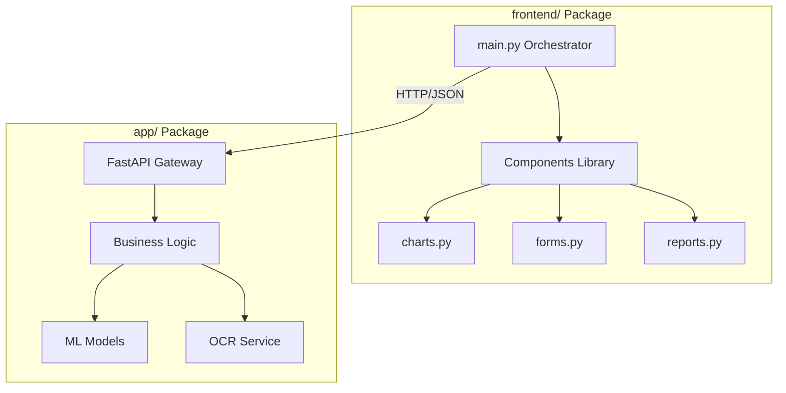

# 🏗️ Project Architecture & Roadmap Map

> **For Your Review**: This document maps your entire filesystem to the "Real-World AI System" narrative. Use this to explain your project structure to recruiters.

## 1. The "Big Picture" Architecture
Your project is structured as a **Microservices-style** monolith, ready to be split if needed.

---

## 2. Directory-by-Directory Breakdown

### 🟢 `frontend/` (The User Interface)
*A modular, component-based UI built with Streamlit.*
*   `main.py`: **The Orchestrator**. It initializes the app and calls components. It contains NO heavy logic.
*   `config.py`: **Single Source of Truth** for settings (API URLs, Page Titles).
*   `utils/api.py`: **API Client Layer**. It handles all `requests` to the backend. Separation of concerns!
*   `components/`:
    *   `sidebar.py`: Handles global state, OCR uploads, and settings.
    *   `forms.py`: Encapsulates the complex patient data input form.
    *   `charts.py`: Reusable Plotly graphing functions (Gauge, Bar charts).
    *   `reports.py`: Logic to generate the text-based clinical report.

### 🔵 `app/` (The Backend API)
*A high-performance REST API built with FastAPI.*
*   `main.py`: **The Gateway**. Defines endpoints (`/predict`, `/analyze`, `/health`).
*   `schemas.py`: **The Contract**. Pydantic models acting as Data Transfer Objects (DTOs).
*   `services.py`: **The Business Logic**. Contains the implementation of OCR and Model calls.

### 🟣 `ml_models/` (The Intelligence Layer)
*The machine learning pipeline.*
*   `dataset_generator.py`: **Synthetic Data Engine**. Creates the training data.
*   `model_trainer.py`: **The Factory**. Trains the Ensemble (XGB, RF, NN) and saves artifacts.
*   `risk_classifier.py`: **The Inference Engine**. Loads models and runs predictions.

### 📄 Documentation (The "Professional" Polish)
*   `INTERVIEW_PITCH.md`: Your script for "Tell me about yourself".
*   `PROJECT_SHOWCASE.md`: A deep-dive into the technical implementation.
*   `DEPLOYMENT_CHECKLIST.md`: Evidence of your DevOps rigor.
*   `TESTING_GUIDE.md`: Proof of quality assurance.

---

## 3. What We Are "Making" (The Narrative)

We are **NOT** making a "Jupyter Notebook".
We **ARE** making a **Clinical Decision Support System (CDSS)** MVP.

### Key Characteristics:
1.  **Modular**: You can swap the frontend (Streamlit) for React without touching the backend.
2.  **Scalable**: You can deploy the Backend on a GPU instance and the Frontend on a cheap CPU instance.
3.  **Resilient**: If OCR fails, the rest of the app still works (Graceful Degradation).
4.  **Auditable**: Every prediction is logged (in theory) and explained via feature importance.

## 4. Future Advancements (The "Roadmap")

If you continue this for a Final Year Project:
1.  **Database**: Add `database/` with `models.py` (SQLAlchemy) to save patient history.
2.  **Auth**: Add `auth/` middleware for Doctor login.
3.  **Monitoring**: Add Prometheus metrics to `app/main.py` to track model drift.
